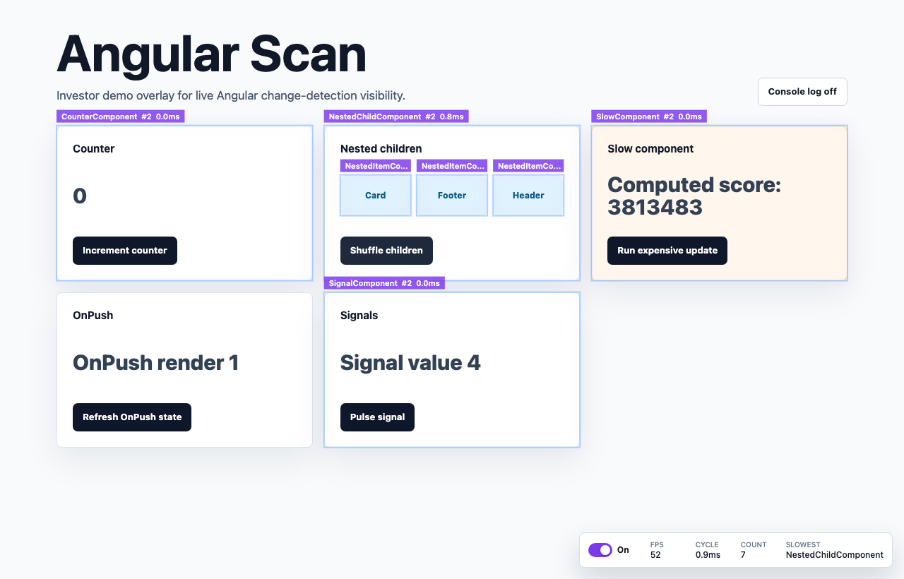

# Angular Scan

Angular Scan is a small investor-demo focused visual overlay for Angular change detection. It mirrors the React Scan style of experience: a floating toolbar, component outlines, compact labels, FPS, latest cycle timing, checked component count, and slowest component.



## Project Docs

- [agent.md](agent.md): repo rules for DDD, type quality, style, and verification.
- [feature.md](feature.md): feature spec, current domain model, next candidates, and highlight color guidance.

## Public API

```ts
import { getOptions, scan, setOptions, stop } from 'angular-scan';

scan({ enabled: true, showToolbar: true });
setOptions({ log: true });
console.log(getOptions());
stop();
```

```ts
interface AngularScanOptions {
  enabled?: boolean;
  showToolbar?: boolean;
  animationSpeed?: 'slow' | 'fast' | 'off';
  showFPS?: boolean;
  log?: boolean;
  dangerouslyForceRunInProduction?: boolean;
  onCycleStart?: () => void;
  onRender?: (entry: AngularRenderEntry) => void;
  onCycleFinish?: (cycle: AngularRenderCycle) => void;
}
```

## Angular Usage

Provider mode gives the demo reliable cycle timing by wrapping `ApplicationRef.tick()`.

```ts
import { bootstrapApplication } from '@angular/platform-browser';
import { provideAngularScan } from 'angular-scan';

bootstrapApplication(AppComponent, {
  providers: [
    provideAngularScan({
      enabled: true,
      showToolbar: true,
      animationSpeed: 'fast'
    })
  ]
});
```

For the v1 investor demo, add `AngularScanMarkDirective` to component host elements that should report per-component labels and durations:

```html
<section angularScanMark="SlowComponent">
  ...
</section>
```

The standalone `scan()` call still starts the overlay for script or npm usage. Deep automatic Ivy component hook patching is intentionally not claimed as complete in this first build.

## Demo

```sh
npm install
npm run dev
```

Open `http://127.0.0.1:4200/`, then click the counter, nested child, slow component, OnPush, and signal buttons. The overlay flashes highlighted components and updates toolbar metrics.

The toolbar switch turns scanning on or off. Marked Angular components update live after button clicks, including nested item components in the demo. The overlay reports visible updates, so a focused OnPush update highlights the OnPush component instead of every component that Angular checked.

## Highlight Colors

The overlay highlight palette is intentionally light blue/violet. Update the tokens in `packages/angular-scan/src/overlay.ts` when changing the scan flash style:

```ts
const HIGHLIGHT_STROKE = [147, 197, 253] as const;
const HIGHLIGHT_GLOW = [216, 180, 254] as const;
const LABEL_BACKGROUND = [124, 58, 237] as const;
```

Keep the alpha fade in the paint loop so fast and slow animations continue to feel smooth.

## Verification

```sh
npm run test
npm run build
npm run test:e2e
```
