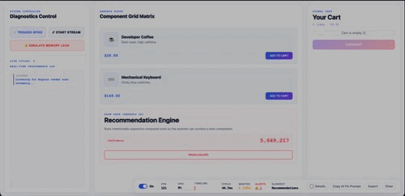

# Angular Render Scan

Angular Render Scan is a visual debugging overlay for Angular change detection. It is inspired by the React Scan experience: install it, run your app, interact with the UI, and see which Angular components are updating, how often they update, and how long they take.



[Live Demo](https://edisonaugusthy.github.io/angular-render-scan/)

## Features

- **Automatic Angular Telemetry:** Out-of-the-box zero-setup component auto-instrumentation using Angular dev-mode profiler hooks.
- **Heatmap & Outlines:** Highlights are colored dynamically based on DOM mutations: **green** for no-op wasted renders, **blue** for text/attribute mutations, and **prominent red borders** for expensive renders exceeding thresholds, making bottlenecks instantly recognizable.
- **CD Trigger Attribution:** Every change detection cycle is labeled with what triggered it — `zone:click`, `zone:setTimeout`, `zone:xhr`, `signal:write`, `router:navigation`, `manual:markForCheck`, and more. The toolbar shows the source of the last cycle at a glance.
- **OnPush Candidates Surface:** Automatically identifies `ChangeDetectionStrategy.Default` components with high wasted-render percentages and ranks them as OnPush conversion candidates with confidence scoring (high/medium/low).
- **Referential Input Stability Detection:** Tracks `@Input()` values across cycles using deep serialization and flags inputs where a new object reference carries the same value — the primary source of OnPush false positives.
- **Zone Pollution Detector:** Flags CD cycles that have no user interaction, no signal write, and no router navigation as suspected Zone pollution. Shows a live feed of polluted cycles in the toolbar.
- **Change Detection Graph:** Builds a session-level component graph of parent→child render relationships, including edge trigger counts and per-node CD strategy metadata.
- **CD Waterfall View:** Click the SVG sparkline in the toolbar to expand a nested horizontal bar breakdown of component check execution stack offsets and children offsets.
- **Non-Intrusive Budget Alerts Feed:** Standardized budget violations (warning/error millisecond limits and rate alerts) are elegantly grouped and logged in a collapsible alerts feed panel, handling concurrent violations cleanly.
- **Live CPU & Main-Thread Telemetry:** Dotted CPU metric toggles a live popup showing detailed frame-lag latency and total main-thread blocking times.
- **Memory Leak Detector Badge:** Automatically tracks zombie components whose DOM elements were disconnected but not properly destroyed.
- **Click-to-Source IDE Integration:** Inspected details panel provides an "Open in Editor" link that deep links directly to Cursor, VS Code or WebStorm, and automatically copies the class query to your clipboard for instant search.
- **Session Export JSON:** Download a full profiling JSON bundle including CPU, cycle timelines, wasted statistics, OnPush candidates, Zone pollution events, and referential instability reports.
- **Dark Mode & Theme Presets:** Sleek dark mode styles that match `prefers-color-scheme`, customizable dynamically via options.
- **Keyboard Shortcuts:** Keyboard hotkeys mapped to toggle scan, details panel, copy prompts, and clear stats instantly.
- **Production Guard:** Automatic safety guard shutting down package overhead entirely outside developer mode. Zone tracker lazy-loaded so it tree-shakes to zero in production bundles.

## Install

```sh
npm install angular-render-scan
```

Angular Render Scan expects Angular 9+ as a peer dependency.

## Zero-Config Setup with the CLI

The fastest way to add Angular Render Scan to any project:

```sh
npx angular-render-scan-cli init
```

The CLI detects `angular.json`, finds your `main.ts` or `app.config.ts`, installs the npm package, and injects `provideAngularRenderScan()` into your providers — no manual editing required.

```sh
npx angular-render-scan-cli init --dry-run      # preview changes without writing
npx angular-render-scan-cli init --script-tag   # use CDN script tag instead of npm
npx angular-render-scan-cli --help
```

## Quick Start (Manual)

Add `provideAngularRenderScan()` to your Angular bootstrap providers.

```ts
import { bootstrapApplication } from '@angular/platform-browser';
import { provideAngularRenderScan } from 'angular-render-scan';
import { AppComponent } from './app/app.component';

bootstrapApplication(AppComponent, {
  providers: [
    provideAngularRenderScan({
      enabled: true,
      animationSpeed: 'fast'
    })
  ]
});
```

Open your app in development mode and interact with the UI. Updated components will flash on screen and the toolbar will update live.

## Script Usage

The package also exposes a browser global build for script-tag style usage.

```html
<script src="https://unpkg.com/angular-render-scan/dist/auto.global.js"></script>
```

The global build starts the overlay with default options. For Angular component-level instrumentation, provider mode is still recommended because it has access to Angular app references and dev-mode hooks.

## API

```ts
import {
  copyAIPrompt,
  getAIPrompt,
  getOptions,
  scan,
  setOptions,
  stop
} from 'angular-render-scan';

scan();
setOptions({ enabled: false });
setOptions({ enabled: true, log: true });
console.log(getAIPrompt());
await copyAIPrompt();
console.log(getOptions());
stop();
```

### `scan(options?)`

Starts Angular Render Scan and creates the overlay if it is not already mounted.

```ts
scan({
  enabled: true,
  showToolbar: true,
  animationSpeed: 'fast'
});
```

### `setOptions(options)`

Updates scanner options at runtime.

```ts
setOptions({
  log: true,
  animationSpeed: 'slow'
});
```

### `getOptions()`

Returns the current resolved options.

```ts
const options = getOptions();
```

### `stop()`

Destroys the overlay and clears scanner state.

```ts
stop();
```

## Options
```ts
interface AngularRenderScanOptions {
  enabled?: boolean;
  showToolbar?: boolean;
  animationSpeed?: 'slow' | 'fast' | 'off';
  showFPS?: boolean;
  log?: boolean;
  dangerouslyForceRunInProduction?: boolean;
  minDurationMs?: number;
  minRenderCount?: number;
  include?: Array<string | RegExp>;
  exclude?: Array<string | RegExp>;
  maxLabelCount?: number;
  maxRecordedCycles?: number;
  showCopyPrompt?: boolean;
  promptContext?: string;
  theme?: Partial<AngularRenderScanTheme>;
  editorProtocol?: 'vscode' | 'webstorm' | 'cursor' | string;
  darkMode?: 'auto' | 'dark' | 'light';

  // CD Trigger Attribution
  showCdGraph?: boolean;

  // Zone Pollution Detector
  maxZonePollutionEvents?: number;           // default: 50
  onZonePollution?: (event: ZonePollutionEvent) => void;

  // OnPush Candidates
  onPushCandidateThreshold?: number;         // wasted-render % threshold, default: 40
  trackComponents?: Array<string | RegExp>;  // limit tracking to specific components

  // Referential Input Stability
  trackReferentialStability?: boolean;       // default: true
  referentialStabilityDepth?: number;        // deep-equal max depth, default: 4

  // Callbacks
  onCycleStart?: () => void;
  onRender?: (entry: AngularRenderEntry) => void;
  onCycleFinish?: (cycle: AngularRenderCycle) => void;
  onBudgetViolation?: (violation: BudgetViolation) => void;
}
```

### Common Options

```ts
provideAngularRenderScan({
  enabled: true,
  showToolbar: true,
  showFPS: true,
  animationSpeed: 'fast',
  maxLabelCount: 20,
  maxRecordedCycles: 30,
  showCopyPrompt: true,
  log: false
});
```

- `enabled`: turns scanning on or off.
- `showToolbar`: shows or hides the floating toolbar.
- `animationSpeed`: controls highlight readability. `'fast'` keeps borders visible for about 1.2s, `'slow'` keeps them visible for about 2.4s, and `'off'` disables visual flashes.
- `showFPS`: shows FPS in the toolbar.
- `log`: prints cycle summaries to the console.
- `dangerouslyForceRunInProduction`: allows the scanner to run outside Angular dev mode.
- `minDurationMs`, `minRenderCount`, `include`, `exclude`: filter low-signal render entries.
- `maxLabelCount`: limits how many highlighted components receive labels.
- `maxRecordedCycles`: controls how many recent cycles are included in the copied AI prompt.
- `showCopyPrompt`, `promptContext`: control the copyable AI performance prompt.

### Basic Debug Config

```ts
provideAngularRenderScan({
  enabled: true,
  showToolbar: true,
  animationSpeed: 'slow',
  maxLabelCount: 12,
  maxRecordedCycles: 20,
  promptContext: 'Angular app using signals and OnPush components'
});
```

Use `animationSpeed: 'slow'` when you want more time to read the borders and labels while interacting with the page.

## Callbacks

```ts
provideAngularRenderScan({
  onCycleStart() {
    console.log('cycle started');
  },
  onRender(entry) {
    console.log(entry.name, entry.latestDuration);
  },
  onCycleFinish(cycle) {
    console.log(cycle.renderedCount, cycle.slowest?.name);
  }
});
```

```ts
interface AngularRenderEntry {
  id: string;
  name: string;
  element: Element;
  rect: DOMRect;
  count: number;
  latestDuration: number;
  averageDuration: number;
  latestCycleId: number;
  reason?: 'input' | 'event' | 'tick' | 'dom' | 'unknown';
  changedInputs?: Array<{ name: string; previous: string; current: string }>;
  selector?: string;
}

interface AngularRenderCycle {
  id: number;
  startedAt: number;
  finishedAt: number;
  duration: number;
  renderedCount: number;
  slowest?: AngularRenderEntry;
  entries: AngularRenderEntry[];
}
```

## Theme

Use `theme` to tune the highlight colors.

```ts
provideAngularRenderScan({
  theme: {
    fast: [147, 197, 253],
    medium: [253, 224, 71],
    slow: [239, 68, 68],
    labelBackground: [124, 58, 237],
    labelBackgroundSlow: [220, 38, 38]
  }
});
```

```ts
interface AngularRenderScanTheme {
  fast: readonly [number, number, number];
  medium: readonly [number, number, number];
  slow: readonly [number, number, number];
  labelBackground: readonly [number, number, number];
  labelBackgroundSlow: readonly [number, number, number];
}
```

## New API Functions

```ts
import {
  getOnPushCandidates,
  getReferentialInstability,
  getZonePollutionEvents,
  getCdGraph
} from 'angular-render-scan';

// Components that are safe to switch to ChangeDetectionStrategy.OnPush
const candidates = getOnPushCandidates(40); // threshold: wasted-render %

// Inputs where a new reference carried the same value
const unstable = getReferentialInstability(1); // minUnstableRefs

// Cycles that fired with no user interaction / signal / router trigger
const pollution = getZonePollutionEvents();

// Session-level component dependency graph
const graph = getCdGraph();
// graph.nodes: per-component stats (cdStrategy, renderCount, wastedChecks, isOnPushCandidate)
// graph.edges: parent→child trigger counts
```

### OnPush Candidate shape

```ts
interface OnPushCandidate {
  componentId: string;
  selector: string;
  wastedRenderPct: number;    // percentage of renders that were no-ops
  totalChecks: number;
  confidence: 'high' | 'medium' | 'low';
  reason: string;
}
```

### Zone Pollution Event shape

```ts
interface ZonePollutionEvent {
  timestamp: number;
  cycleId: string;
  suspectedTrigger: string;   // best-guess Zone task description
  componentCount: number;
}
```

### Referential Instability Report shape

```ts
interface ReferentialInstabilityReport {
  componentId: string;
  selector: string;
  inputKey: string;
  unstableRefCount: number;   // how many times a new ref held the same value
  totalInputChanges: number;
}
```

### Production no-op subpath

For SSR, unit tests, or any context where you want to explicitly import stubs:

```ts
import { getOnPushCandidates } from 'angular-render-scan/noop';
// All functions return empty arrays / null — safe to call anywhere
```

## Toolbar

The toolbar shows:
- scan on/off switch
- FPS
- latest cycle time
- CD trigger source (last cycle — e.g. `zone:click`, `signal:write`)
- changed component count
- slowest component
- OnPush candidates chip (count — click to open ranked list)
- Zone pollution chip (count — click to open event feed)
- copy slow issues prompt
- clear stats button

Drag the toolbar to move it. Use `Details` to inspect one component at a time and pin a recommendation panel.

## Details Mode

Use the `Details` checkbox in the toolbar to inspect individual components without keyboard modifiers.

1. Interact with the page so Angular Render Scan captures a render cycle.
2. Check `Details` in the toolbar.
3. Hover over a captured component to show a dashed highlight.
4. Click the component to pin the recommendation panel.
5. Close the panel when finished.

The recommendation panel shows severity, latest duration, average duration, render count, reason, selector, changed inputs, recent cycles, estimated cost, and component-local Angular recommendations based on the captured issue. For slow components, the panel also shows `Copy Slow Issue Prompt`, which copies a prompt for only that component.

## AI Performance Prompt

Use `Copy Slow Issues Prompt` in the toolbar, or call `getAIPrompt()` / `copyAIPrompt()`, to generate a self-contained prompt for an AI coding assistant. The prompt includes environment details, recent cycle history, the latest cycle, configured thresholds, and an issue list for components exceeding the performance warning threshold (10ms by default).

The copied prompt is intentionally focused: it does not copy every render entry. It lists slow components with selector, latest render time, average render time, render count, reason, changed inputs when available, and an estimated cost based on latest duration, cycle share, and observed render count. It does not include raw DOM nodes, component instances, or source code.

```ts
provideAngularRenderScan({
  promptContext: 'Angular 18 app using signals and OnPush components',
  maxRecordedCycles: 20
});
```

## Keyboard Shortcuts

The visual overlay responds to the following keyboard shortcuts when enabled:

| Shortcut | Description |
|---|---|
| `Alt+Shift+S` | Toggles the active/enabled state of the scanner. |
| `Alt+Shift+D` | Toggles Details Mode (hover inspect and recommendations). |
| `Alt+Shift+C` | Copies the AI performance diagnostic prompt. |
| `Alt+Shift+X` | Clears all telemetry counts and history. |
| `Alt+Shift+T` | Toggles the floating toolbar visibility. |
| `Escape` | Closes any pinned recommendation, CPU breakdown, or CD waterfall panel. |

## Playwright Headless Audit API

You can programmatically verify Angular performance inside Playwright end-to-end tests using the headless audit API.

```ts
import { test, expect } from '@playwright/test';
import { startRenderAudit } from 'angular-render-scan';

test('verify no performance regressions or wasted checks', async ({ page }) => {
  await page.goto('/');

  // Start the audit session
  const audit = await startRenderAudit(page);

  // Interact with the page
  await page.click('button.expensive-operation');

  // Stop the audit session and fetch the telemetry report
  const report = await audit.stop();

  // Validate rendering frequency
  const cardRenders = await report.rendersFor('ProductCardComponent');
  expect(cardRenders).toBeLessThanOrEqual(2);

  // Validate render duration (ms)
  const maxDuration = await report.maxDurationFor('ProductCardComponent');
  expect(maxDuration).toBeLessThan(16.7); // smooth 60fps check

  // Validate overall no-op waste ratio
  const wasteRatio = await report.wastedRenderPercentage();
  expect(wasteRatio).toBeLessThan(20); // max 20% wasted checks

  // Validate budget violations
  const violations = await report.budgetViolations();
  expect(violations.length).toBe(0);
});
```

## Manual Marking

Automatic instrumentation is preferred. If you need a specific manual target, you can still mark an element with `AngularRenderScanMarkDirective`.

```ts
import { AngularRenderScanMarkDirective } from 'angular-render-scan';

@Component({
  standalone: true,
  imports: [AngularRenderScanMarkDirective],
  template: `
    <section angularRenderScanMark="CartSummaryComponent">
      ...
    </section>
  `
})
export class CartSummaryComponent {}
```

## Production Behavior

Angular Render Scan is intended for development and demo debugging. Provider mode checks Angular `isDevMode()` and does not run in production unless explicitly enabled.

```ts
provideAngularRenderScan({
  dangerouslyForceRunInProduction: true
});
```

Use that option carefully. The scanner adds runtime instrumentation, DOM reads, canvas work, and console/debug behavior.

## Demo

Open the hosted demo:

```txt
https://edisonaugusthy.github.io/angular-render-scan/
```

Run the local demo:

```sh
npm install
npm run dev
```

Open:

```txt
http://127.0.0.1:4200/
```

The demo includes signal updates, `OnPush` updates, nested components, and intentionally slow work to show the heatmap behavior.

## Development

```sh
npm run test
npm run build
npm run test:e2e
```

Useful project docs:

- [agent.md](agent.md): DDD rules, domain boundaries, type/style guide, and quality bar.
- [feature.md](feature.md): feature spec, domain model, and roadmap.

## Release

Release runs automatically when changes are pushed to `main`. The workflow bumps
`packages/angular-render-scan/package.json` by one patch version, commits that
version bump back to `main`, publishes the package to npm, and creates a GitHub
release for the new version.

Before the first automated publish, add a valid npm publish token as the GitHub
Actions secret `NPM_TOKEN`. After the package exists on npm, you can instead
configure npm trusted publishing for repository `edisonaugusthy/angular-render-scan`
and workflow filename `release.yml`.

To publish manually:

1. Go to GitHub Actions.
2. Select `Release`.
3. Choose the `main` branch.
4. Click `Run workflow`.
