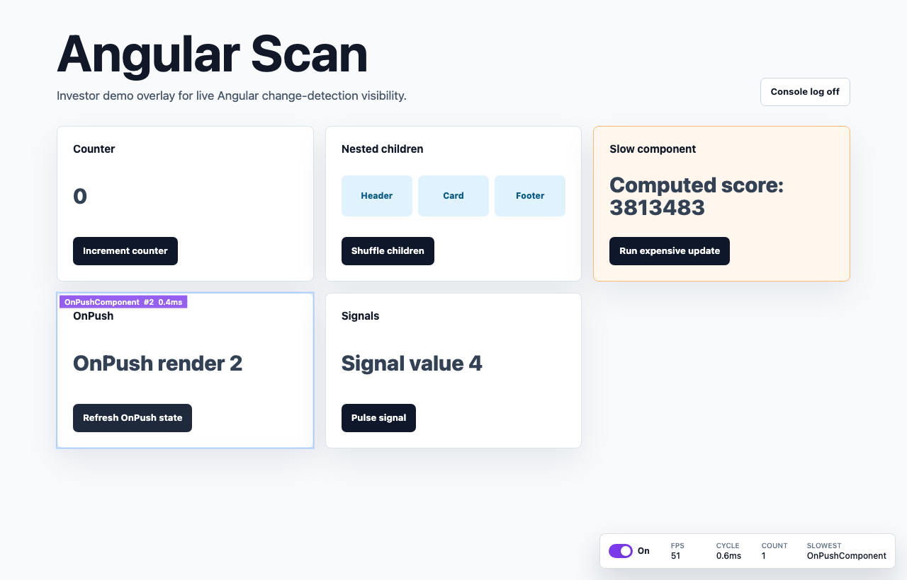

# Angular Render Scan

Angular Render Scan is a visual debugging overlay for Angular change detection. It is inspired by the React Scan experience: install it, run your app, interact with the UI, and see which Angular components are updating, how often they update, and how long they take.



## Features

- Automatic Angular instrumentation through Angular dev-mode profiler hooks where available.
- Provider-based setup for Angular apps.
- Floating shadow-DOM toolbar with scan on/off, FPS, latest cycle time, changed component count, and slowest component.
- Canvas highlights around updated components.
- Compact component labels with component name, count, and latest duration.
- Heatmap colors for fast, medium, and slow updates.
- Optional console reports with `console.table()`.
- Click-to-inspect support with `Cmd`/`Ctrl` + click on a highlighted component.
- Draggable toolbar.
- Production guard by default.

## Install

```sh
npm install angular-render-scan
```

Angular Render Scan expects Angular 9+ as a peer dependency.

## Quick Start

Add `provideAngularRenderScan()` to your Angular bootstrap providers.

```ts
import { bootstrapApplication } from '@angular/platform-browser';
import { provideAngularRenderScan } from 'angular-render-scan';
import { AppComponent } from './app/app.component';

bootstrapApplication(AppComponent, {
  providers: [
    provideAngularRenderScan({
      enabled: true
    })
  ]
});
```

Open your app in development mode and interact with the UI. Updated components will flash on screen and the toolbar will update live.

## Script Usage

The package also exposes a browser global build for script-tag style usage.

```html
<script src="https://unpkg.com/angular-render-scan/dist/auto.global.js"></script>
```

The global build starts the overlay with default options. For Angular component-level instrumentation, provider mode is still recommended because it has access to Angular app references and dev-mode hooks.

## API

```ts
import { getOptions, scan, setOptions, stop } from 'angular-render-scan';

scan();
setOptions({ enabled: false });
setOptions({ enabled: true, log: true });
console.log(getOptions());
stop();
```

### `scan(options?)`

Starts Angular Render Scan and creates the overlay if it is not already mounted.

```ts
scan({
  enabled: true,
  showToolbar: true,
  animationSpeed: 'fast'
});
```

### `setOptions(options)`

Updates scanner options at runtime.

```ts
setOptions({
  log: true,
  animationSpeed: 'slow'
});
```

### `getOptions()`

Returns the current resolved options.

```ts
const options = getOptions();
```

### `stop()`

Destroys the overlay and clears scanner state.

```ts
stop();
```

## Options

```ts
interface AngularRenderScanOptions {
  enabled?: boolean;
  showToolbar?: boolean;
  animationSpeed?: 'slow' | 'fast' | 'off';
  showFPS?: boolean;
  log?: boolean;
  dangerouslyForceRunInProduction?: boolean;
  theme?: Partial<AngularRenderScanTheme>;
  onCycleStart?: () => void;
  onRender?: (entry: AngularRenderEntry) => void;
  onCycleFinish?: (cycle: AngularRenderCycle) => void;
}
```

### Common Options

```ts
provideAngularRenderScan({
  enabled: true,
  showToolbar: true,
  showFPS: true,
  animationSpeed: 'fast',
  log: false
});
```

- `enabled`: turns scanning on or off.
- `showToolbar`: shows or hides the floating toolbar.
- `animationSpeed`: controls highlight fade speed. Use `'off'` to disable visual flashes.
- `showFPS`: shows FPS in the toolbar.
- `log`: prints cycle summaries to the console.
- `dangerouslyForceRunInProduction`: allows the scanner to run outside Angular dev mode.

## Callbacks

```ts
provideAngularRenderScan({
  onCycleStart() {
    console.log('cycle started');
  },
  onRender(entry) {
    console.log(entry.name, entry.latestDuration);
  },
  onCycleFinish(cycle) {
    console.log(cycle.renderedCount, cycle.slowest?.name);
  }
});
```

```ts
interface AngularRenderEntry {
  id: string;
  name: string;
  element: Element;
  rect: DOMRect;
  count: number;
  latestDuration: number;
  averageDuration: number;
  latestCycleId: number;
}

interface AngularRenderCycle {
  id: number;
  startedAt: number;
  finishedAt: number;
  duration: number;
  renderedCount: number;
  slowest?: AngularRenderEntry;
  entries: AngularRenderEntry[];
}
```

## Theme

Use `theme` to tune the highlight colors.

```ts
provideAngularRenderScan({
  theme: {
    fast: [147, 197, 253],
    medium: [253, 224, 71],
    slow: [239, 68, 68],
    labelBackground: [124, 58, 237],
    labelBackgroundSlow: [220, 38, 38]
  }
});
```

```ts
interface AngularRenderScanTheme {
  fast: readonly [number, number, number];
  medium: readonly [number, number, number];
  slow: readonly [number, number, number];
  labelBackground: readonly [number, number, number];
  labelBackgroundSlow: readonly [number, number, number];
}
```

## Toolbar

The toolbar shows:

- scan on/off switch
- FPS
- latest cycle time
- changed component count
- slowest component
- clear stats button

Drag the toolbar to move it. Hold `Cmd` on macOS or `Ctrl` on Windows/Linux and click a highlighted component to inspect the Angular component instance in the console when Angular exposes it.

## Manual Marking

Automatic instrumentation is preferred. If you need a specific manual target, you can still mark an element with `AngularRenderScanMarkDirective`.

```ts
import { AngularRenderScanMarkDirective } from 'angular-render-scan';

@Component({
  standalone: true,
  imports: [AngularRenderScanMarkDirective],
  template: `
    <section angularRenderScanMark="CartSummaryComponent">
      ...
    </section>
  `
})
export class CartSummaryComponent {}
```

## Production Behavior

Angular Render Scan is intended for development and demo debugging. Provider mode checks Angular `isDevMode()` and does not run in production unless explicitly enabled.

```ts
provideAngularRenderScan({
  dangerouslyForceRunInProduction: true
});
```

Use that option carefully. The scanner adds runtime instrumentation, DOM reads, canvas work, and console/debug behavior.

## Demo

Run the local demo:

```sh
npm install
npm run dev
```

Open:

```txt
http://127.0.0.1:4200/
```

The demo includes signal updates, `OnPush` updates, nested components, and intentionally slow work to show the heatmap behavior.

## Development

```sh
npm run test
npm run build
npm run test:e2e
```

Useful project docs:

- [agent.md](agent.md): DDD rules, domain boundaries, type/style guide, and quality bar.
- [feature.md](feature.md): feature spec, domain model, and roadmap.

## Release

Release is manual only.

1. Go to GitHub Actions.
2. Select `Release`.
3. Choose the `main` branch.
4. Click `Run workflow`.

The workflow is guarded so it only runs from `main`. It installs dependencies, builds the package and demo, publishes `packages/angular-render-scan` to npm, and creates a GitHub release using the package version as the tag.
